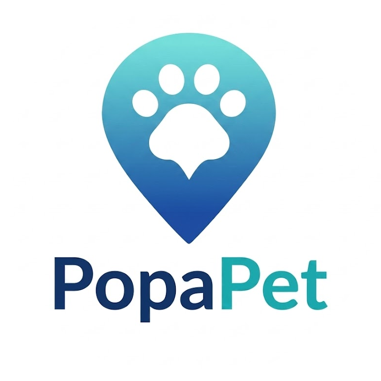
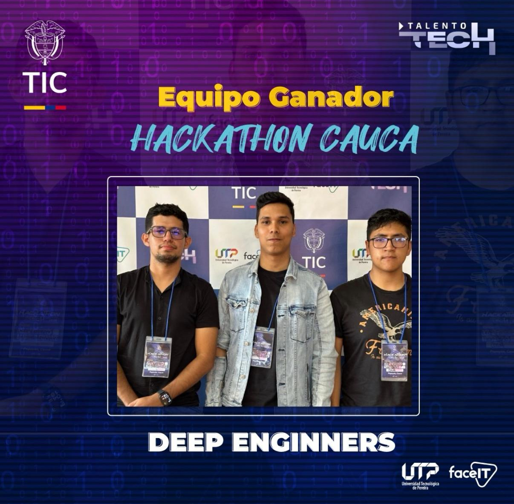
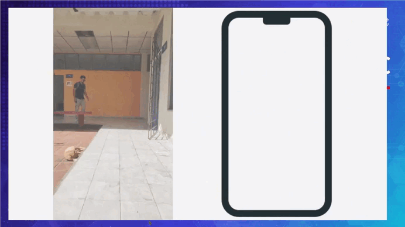
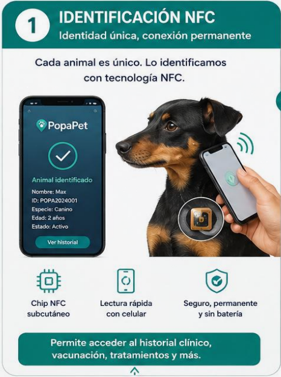
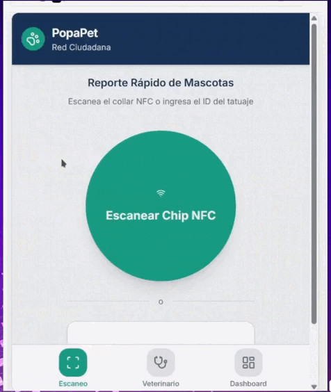
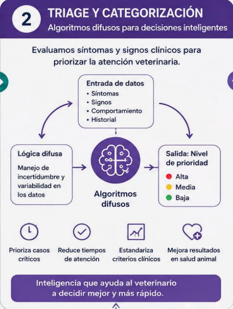
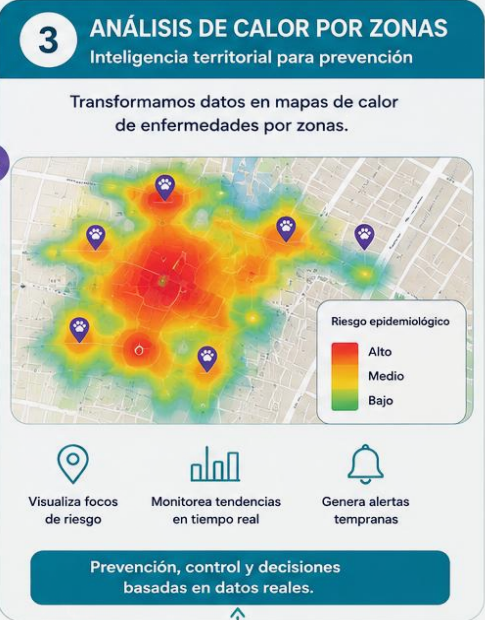
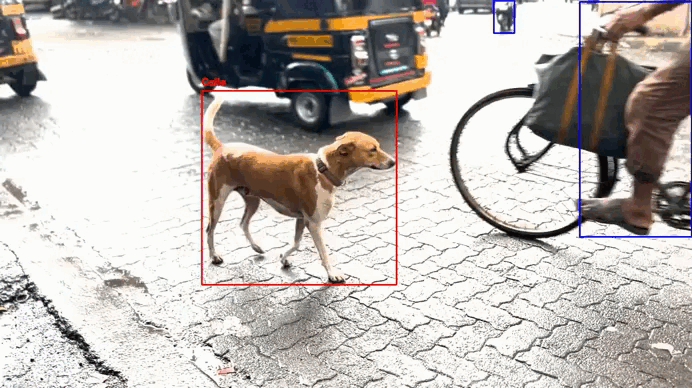

# <table align="center"> <tr> <td></td><td><h5 style="margin: 0; font-size: 22pt;"><b> PopaPet: Inteligencia Sanitaria para el Bienestar Animal </b></h5></td></tr></table>

[](https://talentotech.gov.co/portal/)
[](https://www.python.org/)
[](https://nextjs.org/)
[](https://fastapi.tiangolo.com/)
[](https://github.com/ultralytics/ultralytics)
[](https://es.wikipedia.org/wiki/Inteligencia_artificial)
[](https://es.wikipedia.org/wiki/L%C3%B3gica_difusa)
[](https://en.wikipedia.org/wiki/Near-field_communication)

> 🏆 **Proyecto Ganador del 1er Puesto** en la Hackathon **Talento Tech 2026** en Popayán, Cauca. Desarrollado como una solución tecnológica de alto impacto para la gestión de salud pública y bienestar animal.
<br>
Plataforma integral Web/Móvil impulsada por Inteligencia Artificial y un ecosistema de identificación híbrida (NFC/Tatuaje) para optimizar el triaje, la vigilancia epidemiológica y la atención veterinaria de animales en condición de calle y refugios.
<br>
</br>
<p align="center">
  
  <br>
  <i>Momento de la premiación oficial como ganadores de la Hackathon Talento Tech 2026, organizada por [Talento Tech](https://talentotech.gov.co/portal/)</i>
</p>

---

## El Desafío: Salud Pública y Desarticulación Digital
En Popayán, el manejo veterinario de animales de calle y refugios carece de herramientas predictivas y de articulación digital, generando cuellos de botella críticos:

* **Triaje ineficiente:** Imposibilidad de priorizar casos graves o quirúrgicos en jornadas masivas.
* **Cero trazabilidad:** Ausencia de un historial clínico único accesible.
* **Falta de vigilancia:** Existe una capacidad limitada o nula para identificar y monitorear patrones epidemiológicos, como la rabia y otras enfermedades zoonóticas. Esto dificulta la prevención, el control y la toma de decisiones oportunas en salud pública y bienestar animal.
* **Silos de información:** Desarticulación entre refugios, veterinarios, universidades y secretarías de salud.

## Nuestra Solución
PopaPet digitaliza y centraliza la atención veterinaria transformando a los animales en sus propios portadores de información mediante un **ecosistema de identificación híbrido (NFC + Tatuaje)** que actúa como llave hacia su Ficha Única Veterinaria.

<p align="center">
  
</p>

### Funcionalidades Core

#### 1. Identidad Digital Inviolable
Escaneo NFC mediante dispositivos móviles que geolocaliza la interacción y despliega el historial clínico instantáneamente.
<p align="center">
  
</p>

#### 2. Registro Multimodal (Manos Libres)
Procesamiento de Lenguaje Natural (NLP) para dictar diagnósticos, síntomas y signos vitales en tiempo real, agilizando la atención en campo.
<p align="center">
  
</p>

#### 3. Triaje Automatizado
Algoritmos de **Lógica Difusa** y modelos predictivos para clasificar el riesgo y predecir patologías basadas en los antecedentes del animal.
<p align="center">
  
</p>

#### 4. Vigilancia Epidemiológica
Mapas de calor interactivos para identificar focos de infección y prevenir crisis de salud pública.
<p align="center">
  
</p>

#### 5. Detección de Abandono
Modelo de IA basado en **Transfer Learning (YOLOv8)**, entrenado para identificar y detectar animales en condición de calle o abandono a partir de videos de vigilancia urbana.
<p align="center">
  
</p>

---

## Arquitectura y Tecnologías

El proyecto se estructura en módulos independientes de alta escalabilidad:

* **Frontend / UI (`/frontend`):** Aplicación web interactiva construida con **Next.js** y **TypeScript**
* **Backend y Modelos de IA (`/ai-backend`):** Procesamiento de datos con **Python**. Integración de **Logica Difusa** con **Random Forest** (clasificación de triaje) y **YOLOv8** (visión artificial).
* **Hardware/IoT:** Dispositivos **NFC** para la lectura y escritura de la Ficha Única Veterinaria.

### Estructura del Repositorio
```text
├── ai-backend         # Modelos de Machine Learning, YOLOv8 y API en Python
├── frontend           # Dashboard en Next.js y componentes de visualización
├── media              # Assets, imágenes y demostraciones del README
└── README.md
```

## Enlaces del Proyecto

| Módulo | Enlace de Acceso | Estado |
| :--- | :--- | :--- |
| **Detector de Animales (IA)** | [Streamlit App](https://detector-animales-hfwunvrqtahgsgav7kehym.streamlit.app/) | `● Online` |
| **MVP Clasificación & Dashboard** | [Vercel Deployment](https://popa-pet-mvp.vercel.app/) | `● Online` |

---

### Reconocimientos y Origen del Proyecto

**PopaPet** nació y fue galardonado con el **1er Puesto** en la Hackathon **Talento Tech 2026**, un espacio de innovación abierta diseñado para resolver problemáticas de alto impacto social mediante tecnología de vanguardia.

* **Evento:** Hackathon Talento Tech 2026
* **Reconocimiento:** Primer Lugar (Categoría Salud Pública y Bienestar Animal)
* **Organizador:** 
  * Talento Tech


## Autores

| Nombre | Carrera | GitHub |
| :--- | :--- | :--- |
| **Manuel David Escobar Figueroa** | Ingeniería de Sistemas | [@Physanto](https://github.com/Physanto) |
| **Miguel Stiven Mendieta Hernández** | Ingeniería en Automática Industrial | [@MiguelHZ21](https://github.com/MiguelHZ21) |
| **Juan Carlos Coral Tulcán** | Ingeniería en Automática Industrial | *Por definir* |
